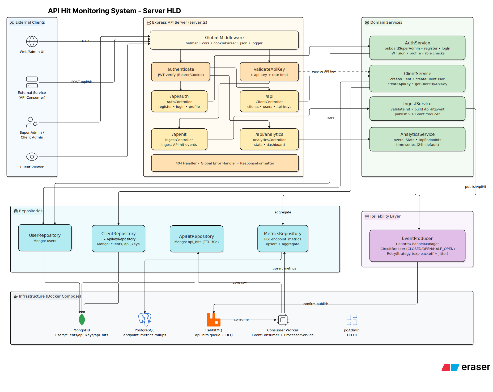

# APIMS : API Hit Monitoring System

A multi-tenant platform that any backend service can report its API traffic to. A downstream service drops in a small middleware, every request it serves gets reported asynchronously, and APIMS turns that stream into per-client analytics: hit counts, error rates, latency, and top endpoints - without the downstream service ever blocking on the report.



This repository contains two independent applications:


| Folder                              | What it is                                                                                                                                                                                      | README                                                 |
| ----------------------------------- | ----------------------------------------------------------------------------------------------------------------------------------------------------------------------------------------------- | ------------------------------------------------------ |
|[server/](./server)| The monitoring platform itself - ingestion API, RabbitMQ pipeline, consumer worker, auth, and analytics|[server/README.md](./server/README.md)|
|[demo/blog_api/](./demo/blog_api)| A small sample Express service that reports its own traffic to APIMS, used to generate realistic demo data. Demonstrate how to configure and integrate your application with the APIMS service. |[demo/blog_api/README.md](./demo/blog_api/README.md)|


## Why this exists

Most small services don't have an observability story until something breaks in production. APIMS is a lightweight, self-hosted alternative to wiring every service into a heavyweight observability stack: integrate a single middleware, and get a dashboard of traffic patterns and failure rates per client, per service, per endpoint.

## Repository structure

```
APIMS/
├── server/                    # the monitoring platform (see server/README.md)
│   ├── src/
│   │   ├── services/
│   │   │   ├── auth/          # JWT auth, RBAC, user onboarding
│   │   │   ├── client/        # tenant + API key management
│   │   │   ├── ingest/        # hit ingestion endpoint
│   │   │   ├── analytics/     # dashboard read APIs
│   │   │   └── processor/     # RabbitMQ consumer + persistence
│   │   └── shared/            # config, middlewares, events, models, utils
│   ├── docker-compose.yml
│   ├── Dockerfile             # API server image
│   └── Dockerfile.consumer    # consumer worker image
├── demo/
│   └── blog_api/              # sample integrated service (see demo/blog_api/README.md)
└── docs/                      # More Info. About the Project
```


## Quick start

The fastest way to see the whole system working end to end:

1. Start the platform's infrastructure and app containers: see `Running with Docker` inside the [server/README.md](./server/README.md) walkthrough.
2. Onboard a super admin, then a client and an API key, against the running server.
3. Configure and run the demo blog API with that API key: see [demo/blog_api/README.md](./demo/blog_api/README.md).
4. Run the blog API's load-test script to generate sample traffic, then query `GET /api/analytics/dashboard` on the server to see it reflected.


## Check Docs to Know

- [What this service does ?](./docs/what-this-service-does.md)
- [Architecture](./docs/architecture.md)
- [Data flow: ingesting a hit](./docs/ingesting-a-hit.md)
- [Why two databases ?](./docs/why-two-databases.md)
- [Reliability design](./docs/reliability-design.md)
- [Multi-tenancy and auth model](./docs/multi-tenancy-and-auth-model.md)


## Tech stack at a glance

The server is built on `Express 5` and `TypeScript`, with `MongoDB` for raw event storage, `PostgreSQL` for aggregated metrics, and `RabbitMQ (via amqplib)` for decoupling ingestion from persistence. Authentication uses `JWT` and `bcrypt`; validation uses `Zod`; structured logging uses `Winston`. The demo blog API is a minimal Express service with no database of its own, included purely to exercise the monitoring pipeline with realistic traffic.

## Contact

Connect with me on :  

- [GitHub](https://github.com/Asif-Ali-13)  
- [LinkedIn](https://www.linkedin.com/in/asif-ali-267772285/)


## License

This project is released under the MIT License.