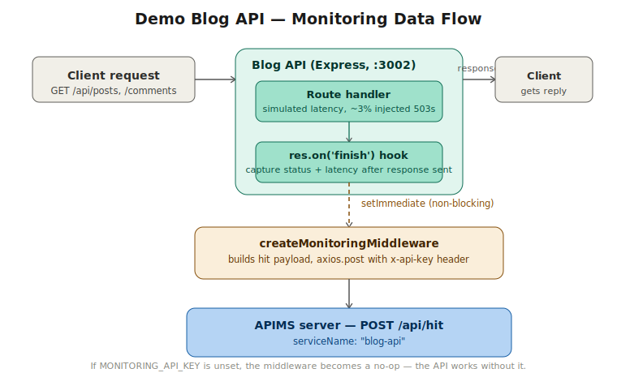

# Demo Blog API

A minimal Express service with no database of its own, included in this repository purely to demonstrate how a real downstream service integrates with the APIMS monitoring platform - and to generate realistic traffic for its dashboards.

This is a demo, not a reference architecture for a blog API. The interesting part of this folder is `src/monitoring.ts`, not the blog routes.


## What you get


| Piece                                            | Purpose                                               |
| ------------------------------------------------ | ----------------------------------------------------- |
| `[src/server.ts](./src/server.ts)`               | Sample REST API (posts + comments)                    |
| `[src/monitoring.ts](./src/monitoring.ts)`       | Reusable Express middleware - copy into your own apps |
| `[scripts/load-test.ts](./scripts/load-test.ts)` | Generates sample traffic for dashboards               |
| `.env.sample`                                    | Environment template                                  |


## Data flow



A client calls one of the blog routes as normal. The route handler does its work and sends a response immediately - the client is never made to wait on monitoring. Once the response has actually been sent (`res.on('finish')`), the monitoring middleware measures the elapsed latency, builds a hit payload (service name, endpoint, method, status code, latency, IP, user agent), and fires it off to the APIMS server's `POST /api/hit` endpoint inside `setImmediate`, so the reporting call never blocks or delays the response that already went out.

If `MONITORING_API_KEY` isn't set, the middleware is a no-op: the blog API works completely normally with monitoring silently disabled, which is what makes `src/monitoring.ts` safe to copy into another service without forcing that service to depend on APIMS being available.


## How monitoring integration works


### 1. Mount middleware early

In `src/server.ts`, monitoring runs after body parsers and before routes. This file is written to be copied, not imported as a package. Drop it into any Express service, then:

```ts
import createMonitoringMiddleware from "./monitoring";

app.use(createMonitoringMiddleware({
  serviceName: "your-service-name",
  enableLogging: true,
}));
```

Configure it via environment variables (or by passing options directly, which take precedence):


| Variable              | Purpose                                                                      |
| --------------------- | ---------------------------------------------------------------------------- |
| `MONITORING_API_KEY`  | API key issued by APIMS for this client. Omit to disable reporting entirely. |
| `MONITORING_ENDPOINT` | APIMS ingest URL. Defaults to `http://localhost:5001/api/hit`.               |
| `SERVICE_NAME`        | Logical name this service's hits are grouped under in analytics.             |
| `MONITORING_ENABLED`  | Set to `false` to disable reporting without removing the middleware.         |


### 2. Payload sent to ingest

For each completed response, the middleware POSTs JSON to the monitoring server:

```json
{
  "serviceName": "blog-api",
  "endpoint": "/api/posts?tag=monitoring",
  "method": "GET",
  "statusCode": 200,
  "latencyMs": 142,
  "ip": "::1",
  "userAgent": "curl/8.5.0"
}
```

Required header:

```http
x-api-key: <your MONITORING_API_KEY>
```

A successful ingest returns **202 Accepted** (hit queued). Invalid or missing keys return **401** / **403**.


### 3. Use in your own project

1. Copy `src/monitoring.ts` into your service.
2. `npm install axios` (and types if you use TypeScript).
3. Set `MONITORING_API_KEY` and `MONITORING_ENDPOINT` in your environment.
4. `app.use(createMonitoringMiddleware({ serviceName: "my-service" }))`.

Use a **distinct** `serviceName` **per microservice** so analytics can filter by service.


## Running it

Requires an APIMS server already running and an API key issued for this service (see the [server README](../../server/README.md) for onboarding a client and creating a key).

```bash
cd demo/blog_api
npm install
cp .env.sample .env     # fill in MONITORING_API_KEY after onboarding
npm run dev
```

By default it listens on port `3002`.

```
GET  /                            # service info
GET  /health                      # health check
GET  /api/posts                   # list posts (supports ?author=, ?tag=, ?limit=)
GET  /api/posts/:postId/comments  # comments for one post
```


## Generating sample traffic

```bash
npm run load-test
```

This runs `scripts/load-test.ts`, which sequentially calls each route a few times with short pauses between requests, purely to populate the APIMS dashboard with a believable mix of services, status codes, and latencies. It is a traffic generator for demo purposes, not a throughput or load-testing tool - it does not measure or report requests-per-second, and isn't intended to validate APIMS under concurrent load.


## Viewing metrics on the monitoring server

After traffic flows and the processor runs, query analytics (requires `canViewAnalytics` or super admin). The monitoring server stores the JWT in an **httpOnly cookie** named `authToken` after login - pass it with `curl -b`, not an `Authorization` header.


```bash
# Login and save the authToken cookie
curl -c cookies.txt -X POST http://localhost:5001/api/auth/login \
  -H "Content-Type: application/json" \
  -d '{"username":"your-user","password":"your-password"}'


# Analytics (cookie sent automatically)
curl -b cookies.txt \
  "http://localhost:5001/api/analytics/stats?startTime=2026-05-01"


curl -b cookies.txt \
  "http://localhost:5001/api/analytics/dashboard"
```

Super admins may pass `?clientId=<mongoId>` to scope a tenant; omit it for global stats.

The API also accepts `Authorization: Bearer <token>` if you extract the JWT yourself, but the default auth flow uses the `authToken` cookie. See `[server/README.md](../../server/README.md)` for full API documentation.

Filter by `serviceName: blog-api` in the response to see only this demo’s traffic.


## Project layout

```text
demo/blog_api/
├── src/
│   ├── server.ts       # Express app + mock posts/comments
│   ├── monitoring.ts   # Ingest middleware (portable)
│   └── types.ts        # Post / Comment types
├── scripts/
│   └── load-test.ts    # Sample traffic generator
├── tsconfig.json
├── package.json
├── .env.sample
└── README.md
```


## Scripts


| Command             | Description                                                 |
| ------------------- | ----------------------------------------------------------- |
| `npm run dev`       | Run with `tsx` watch on `src/server.ts`                     |
| `npm run build`     | Compile to `dist/`                                          |
| `npm start`         | Run compiled `dist/server.js`                               |
| `npm run load-test` | Hit common endpoints 3× (`BLOG_API_URL` overrides base URL) |


## Troubleshooting


| Symptom                                        | Check                                                                                                                      |
| ---------------------------------------------- | -------------------------------------------------------------------------------------------------------------------------- |
| `Monitoring: DISABLED` on startup              | `MONITORING_API_KEY` missing in `.env`                                                                                     |
| `Failed to send monitoring data: 403`          | Wrong host/port (use **5001** for docker, **5000** for local `npm run dev`), invalid API key, or missing ingest permission |
| `Failed to send monitoring data: ECONNREFUSED` | Monitoring server not running on `MONITORING_ENDPOINT`                                                                     |
| Analytics empty                                | Processor running? Enough traffic? Time range includes recent hits?                                                        |
| No console ingest logs                         | `NODE_ENV=production` disables logs unless `enableLogging: true`                                                           |


## License

MIT 