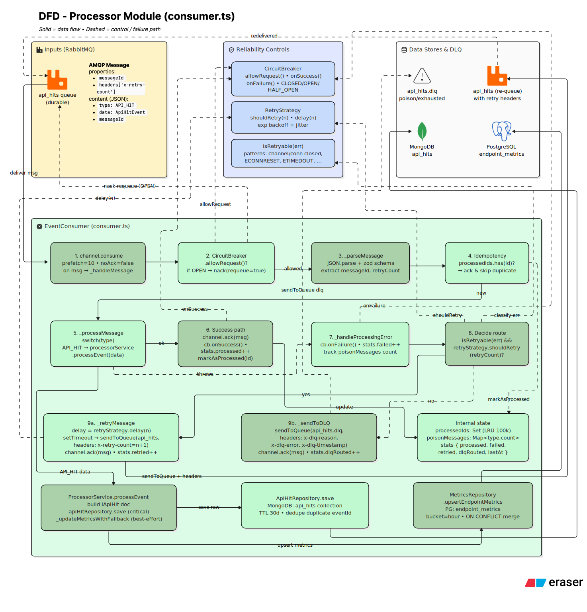

# Architecture

The service is split into two independently deployable processes that share the same codebase but never talk to each other directly:

The **API server** (`src/server.ts`) is a normal Express app handling synchronous request/response traffic: authentication, client/API-key management, hit ingestion, and analytics reads. When it ingests a hit, it does not write to a database directly - it hands the event to an event producer, which publishes it to RabbitMQ and returns immediately.

The **consumer** (`src/services/processor/consumer.ts`) is a separate Node process, started independently (`npm run processor`, or the `consumer` service in `docker-compose.yml`), that subscribes to the RabbitMQ queue and is the only part of the system that writes hit data to MongoDB and PostgreSQL.

This split means a backlog in the consumer, a failed database write, or a temporary RabbitMQ outage degrades or pauses analytics processing without ever blocking or slowing down the client services calling `POST /api/hit`- they get a fast response either way, and the circuit breaker fails them fast and explicitly if the queue itself is unavailable, rather than hanging.