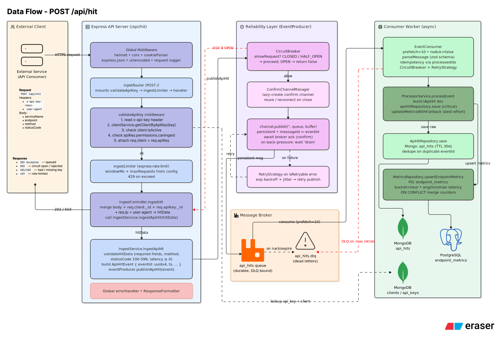

# Data flow: ingesting a hit



A request to `POST /api/hit` goes through, in order: API key validation (is the key valid, is the client active, does the key have ingest permission), a per-route rate limiter, and payload validation (required fields, valid HTTP method, status code in range, non-negative latency).

### Example: ingesting a hit

```bash
curl -X POST http://localhost:5001/api/hit \
  -H "x-api-key: <client_api_key>" \
  -H "Content-Type: application/json" \
  -d '{
    "serviceName": "blog-api",
    "endpoint": "/api/posts",
    "method": "GET",
    "statusCode": 200,
    "latencyMs": 42
  }'
```

If validation passes, the `EventProducer` checks its circuit breaker. If the breaker is `CLOSED` or `HALF_OPEN`, it attempts to publish the event to RabbitMQ over a confirm channel and waits for the broker's acknowledgment; on a retryable error (connection reset, timeout, channel closed) it retries with exponential backoff and jitter up to a configured maximum, then opens the circuit on continued failure. If the breaker is `OPEN`, the request is rejected immediately with a `rejected` / `service_unavailable` result rather than attempting a publish that's likely to fail or time out.

Once RabbitMQ confirms the publish, the API server's job for that event is done. The consumer process picks the message up independently: it parses and schema-validates the message body, then either processes it (saving the raw event to MongoDB and upserting hourly metrics in PostgreSQL) or, on failure, decides between a delayed in-queue retry (for errors classified as transient) and routing the message to a dead-letter queue (for non-retryable errors or once retries are exhausted), tagging it with the failure reason, the original error message, and a timestamp.