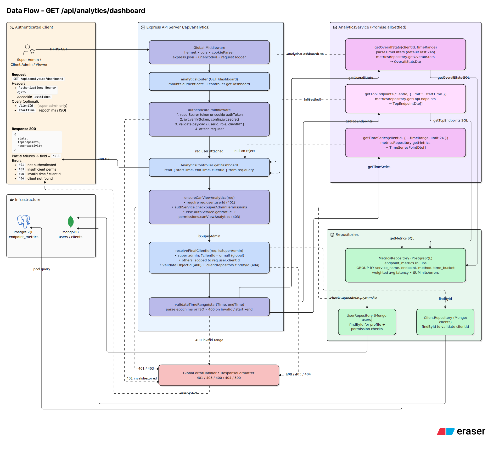

# Analytics Service 

`Analytics` is the read side for everything `processor` has aggregated. It exposes endpoints like `/stats` and `/dashboard` that query PostgreSQL's rollup table directly rather than scanning raw MongoDB events, which is precisely why dashboard reads stay fast regardless of how large the raw event log grows. This service answers "what does my traffic look like" - total hits, error rate, latency stats, top endpoints, and a recent time series - scoped to whichever client the authenticated caller belongs to.

## API reference

All endpoints are prefixed with `/api/analytics`. Authenticated routes expect a JWT, set via an HTTP-only cookie on login.

[ANALYTICS-POSTMAN-API-DOCUMENTATION](https://documenter.getpostman.com/view/39489029/2sBXwyHnjR#06f211c2-8da4-4433-998c-4d6b2e9f7b67)

| Method | Path | Auth | Description |
|---|---|---|---|
| `GET` | `/api/analytics/stats` | authenticated | Overall hit/error/latency stats for the caller's scope |
| `GET` | `/api/analytics/dashboard` | authenticated | Combined stats + top endpoints + recent time series |

## Dataflow Diagram of Analytics Endpoints

