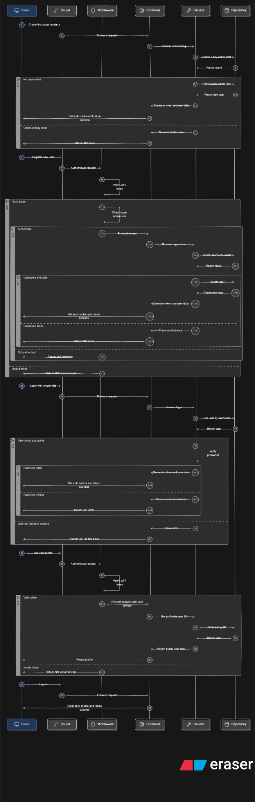

# Auth Service

`Auth` handles human-user identity and access control for the platform itself. It covers the one-time super-admin bootstrap flow (the first call to onboard a super admin locks the endpoint permanently afterward), user registration, login issuing a JWT set as an HTTP-only cookie, password hashing via bcrypt with a weak-password blacklist, and a three-tier role system (`SUPER_ADMIN`, `CLIENT_ADMIN`, `CLIENT_VIEWER`) enforced through a route-level `authorize([roles])` middleware. This service answers "who is this human, and what are they allowed to do" - it's separate from API-key auth, which is a different mechanism used by client services rather than people.

## Api EndPoints

This Service responsible for Login, register, and super-admin onboarding set an **httpOnly cookie** named `authToken` (JWT). Protected routes read the token from:

1. Cookie `authToken` (primary - used by this API’s auth flows)
2. Header `Authorization: Bearer <token>` (also supported by `authenticate` middleware)

All endpoints are prefixed with `/api/auth`. Authenticated routes expect a JWT, set via an HTTP-only cookie on login.

[AUTH-POSTMAN-API-DOCUMENTATION](https://documenter.getpostman.com/view/39489029/2sBXwyHnjR#5dd80bb2-c971-4db2-b043-389a7aada175)

| Method | Path                            | Auth                   | Description                     |
| ------ | ------------------------------- | ---------------------- | ------------------------------- |
| `POST` | `/api/auth/onboard-super-admin` | none (one-time)        | Bootstrap the first super admin |
| `POST` | `/api/auth/register`            | super admin            | Create a new user               |
| `POST` | `/api/auth/login`               | none                   | Authenticate, sets JWT cookie   |
| `GET`  | `/api/auth/profile`             | any authenticated user | Current user's profile          |
| `GET`  | `/api/auth/logout`              | none                   | Clears the JWT cookie           |

## Sequence Diagram

To see the Data-flow diagrams of the following - 

| DFD                | PATH                                                                                                                              |
| ------------------ | --------------------------------------------------------------------------------------------------------------------------------- |
| `onBoadSuperAdmin` | [server/public/dataflow-diagrams/onboarSuperAdmin](../../../public/dataflow-diagrams/onBoardingSuperAdmin-dataflow-diagram.svg) |
| `register`         | [server/public/dataflow-diagrams/auth-register](../../../public/dataflow-diagrams/auth-register-dataflow-diagram.svg)          |

