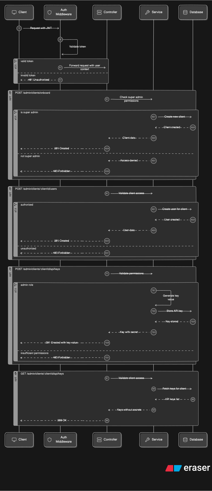

# Client Service

`client` manages tenants and their API keys - the multi-tenancy backbone of the system. It covers onboarding a new client organization, creating users scoped under a client, and issuing/listing API keys, where each key carries its own permission flags (currently `canIngest`) and only ever has its secret shown once at creation time. It's also responsible for the active/inactive status check on a client that validateApiKey relies on, so a deactivated client's keys stop working immediately even if the key itself wasn't revoked individually.

## Api EndPoints

All endpoints are prefixed with `/api/admin/clients`. Authenticated routes expect a JWT, set via an HTTP-only cookie on login.

[CLIENT-POSTMAN-API-DOCUMENTATION](https://documenter.getpostman.com/view/39489029/2sBXwyHnjR#d41f09e5-a59c-4748-ba68-c6cf6fe63f3d)

| Method | Path | Auth | Description |
|---|---|---|---|
| `POST` | `/api/admin/clients/onboard` | super admin | Create a new tenant client |
| `POST` | `/api/admin/clients/:clientId/users` | authenticated | Create a user under a client |
| `POST` | `/api/admin/clients/:clientId/api/keys` | authenticated | Issue a new API key (secret returned once) |
| `GET` | `/api/admin/clients/:clientId/api/keys` | authenticated | List a client's API keys (no secrets) |

## Sequence Diagram 

To see the Data-flow diagrams of the following - 

| DFD | PATH |
|---|---|
| `client-onboard` | [server/public/dataflow-diagrams/client-onboard](../../../public/dataflow-diagrams/client-onboard-dataflow-diagram.svg) |
| `clientUser-onboard` | [server/public/dataflow-diagrams/clientUser-onboard](../../../public/dataflow-diagrams/clientUser-onboard-dataflow-diagram.svg) |
| `client-createApiKey` | [server/public/dataflow-diagrams/client-createApiKey](../../../public/dataflow-diagrams/client-createApiKey-dataflow-diagram.svg) |

